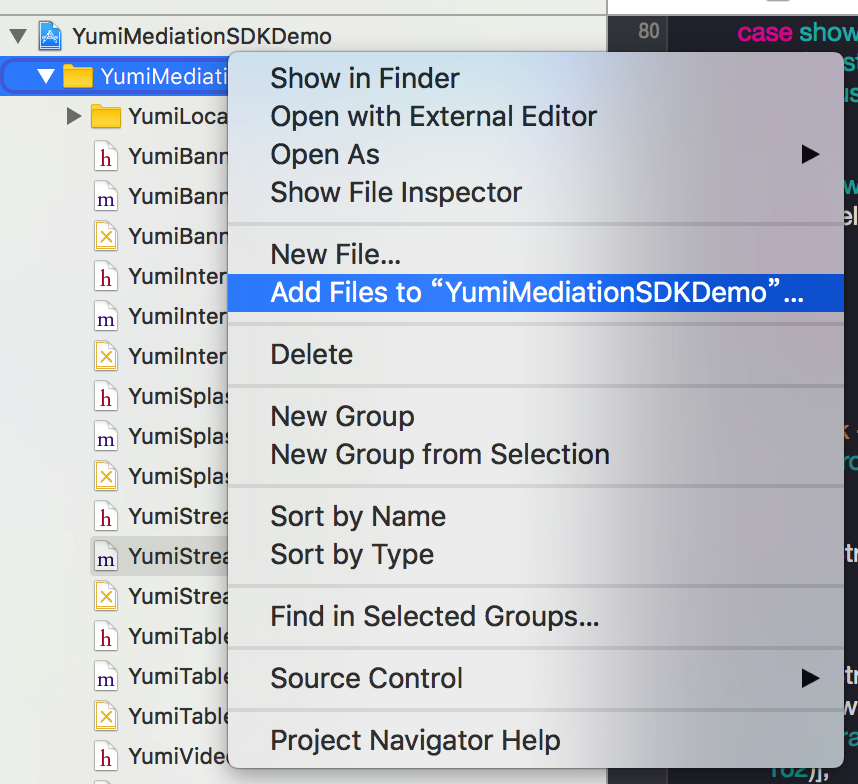
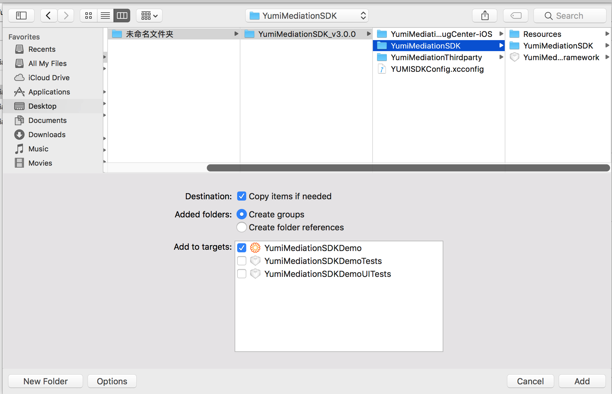
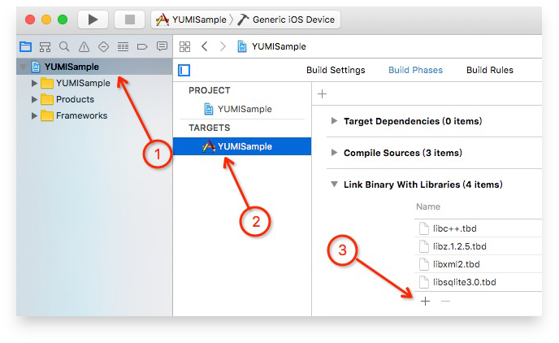

# 导入 Yumi SDK
## CocoaPods (preferred)
CocoaPods 是 iOS 的依赖管理工具，使用它可以轻松管理 YumiMediationSDK。

打开您工程的 Podfile，选择下面其中一种方式添加到您应用的 target。

如果您是初次使用 CocoaPods，请查阅 [CocoaPods Guides](https://guides.cocoapods.org/using/using-cocoapods.html) 。

```ruby
pod "YumiMediationSDK"
```

- 如果您需要聚合其他平台

```ruby
pod "YumiMediationAdapters", :subspecs => ['AdColony','AdMob','AppLovin','Baidu','Chartboost','Domob','Facebook','GDT','InMobi','IronSource','Unity','Vungle','Mintegral','OneWay','ZplayAds','TapjoySDK','BytedanceAds','InneractiveAdSDK','PubNative']
```

接下来在命令行界面中运行：

```ruby
$ pod install --repo-update
```

最终通过 workspace 打开工程。

## 手动集成

1. 下载 ([SDKDownloadPage-iOS](https://github.com/yumimobi/YumiMediationSDKDemo-iOS/blob/master/normalDocuments/iOSDownloadPage.md)) YumiMediationSDK 及您所需的三方平台

2. 添加 YumiMediationSDK 及您所需的三方平台到您的工程

 
 

3. 配置脚本

按照如图所示步骤，添加 YumiMediationSDKConfig.xcconfig

 

4. 导入 Framework

导入如图所示的系统动态库。

 
